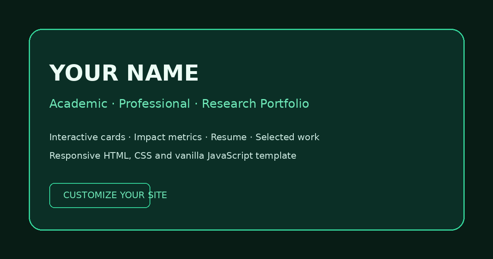

# Swagat Das — Research Portfolio and Reusable Website Template

This repository contains two separate items:

1. **My live portfolio website** at [das-swagat.github.io](https://das-swagat.github.io)
2. **A reusable academic, professional, and research portfolio template** inside [`portfolio-template/`](portfolio-template/)



## Use the reusable template

The simplest method is:

1. Download [`academic-professional-research-portfolio-template.zip`](academic-professional-research-portfolio-template.zip).
2. Extract it.
3. Create a new GitHub repository.
4. Upload the extracted files to the **root** of the new repository.
5. Replace the placeholder content in `index.html`.
6. Replace `assets/sample-resume.pdf` with your own document.
7. Enable GitHub Pages from **Settings → Pages → Deploy from a branch → main → /(root)**.

A live template preview is available at:

**[das-swagat.github.io/portfolio-template/](https://das-swagat.github.io/portfolio-template/)**

Detailed customization instructions are in [`portfolio-template/README.md`](portfolio-template/README.md). The template `index.html` also contains searchable `CUSTOMIZE` comments for identity, links, colors, layouts, metrics, cards, animations, and resume files.

## Repository structure

```text
index.html                                      Personal website
assets/Swagat_Das_Resume.pdf                    Resume used by the personal website
README.md                                       This overview
portfolio-template/                             Reusable sanitized template
academic-professional-research-portfolio-template.zip
                                                Ready-to-download template package
configure-github-repository.sh                  Optional one-command metadata setup
```

## License

The code in `portfolio-template/` is released under the **MIT License**. No registration, application, payment, or approval is required. The full legal permission is the [`portfolio-template/LICENSE`](portfolio-template/LICENSE) file; keeping that file with copies or substantial modifications is the main requirement.

My personal biography, resume, publications, project descriptions, affiliations, and other identifying content in the repository root are **not** part of the reusable template license.

## Repository description and topics

GitHub stores the repository **About description, website URL, and topics outside the uploaded files**. Replacing repository files does not change those settings.

The optional script [`configure-github-repository.sh`](configure-github-repository.sh) sets them together using GitHub CLI after authentication. It is not required if the About section and topics are already correct.
